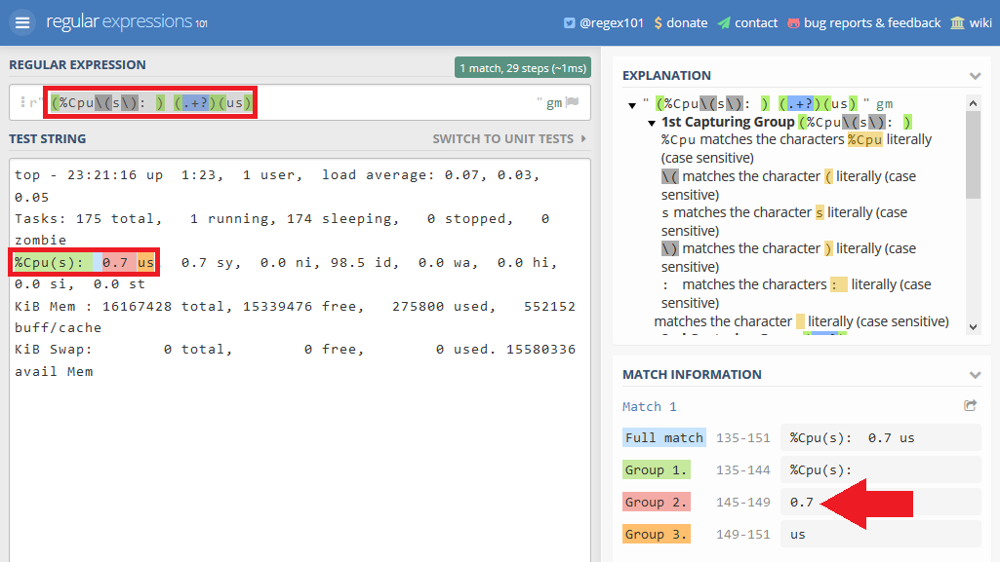
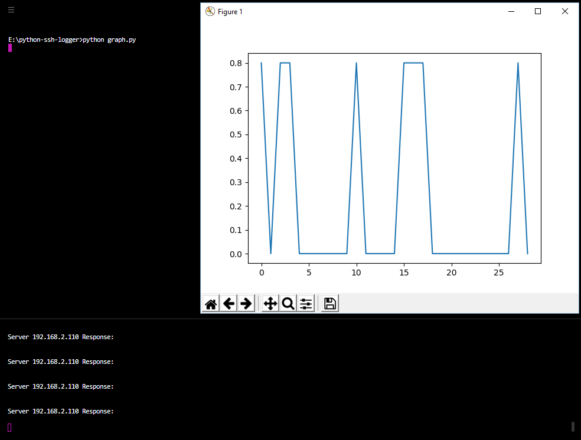

```bash
....................................................................................................
....................................................................................................
................:???%*..............................................................................
..............???????????...........................................................................
.............??.?????????%..........................................................................
.............?:..???????%%..........................................................................
.............??.%??????%%%..........................................................................
.............?????????%%%%..........................................................................
...................;?%%%%%..........................................@@:.............................
........:????%%%%%%%%%%%%%.::::.............................@@......@@:.............................
.......????????????%%%%%%%.:::::............................@@......@@:.............................
......:???????????%%%%%%%%.:::::,.....@@??@@?..@@@....@@..@@@@@@@...@@:@@@.....;@@@+....@@.@@@......
......???????????%%%%%%%%%.::::::.....@@%@@@@+..@@...@@@..@@@@@@@...@@#@@@@...@@@@@@@...@@@@@@@.....
......??????????%%%%%%%%%%.::::::.....@@@..@@@..@@@..@@:....@@......@@@..@@...@@...@@...@@@.S@@.....
......?????????%%%%%%%%%%.:::::::.....@@@...@@..,@@..@@.....@@......@@+..@@..?@@...@@#..@@...@@.....
......????????,..........::::::::.....@@#...@@...@@.@@@.....@@......@@:..@@..@@@...@@@..@@...@@.....
......??????%..::::::::::::::::::.....@@@...@@...@@@@@......@@......@@:..@@..@@@...@@@..@@...@@.....
......??????.,::::::::::::::::::;.....@@@..S@@....@@@@......@@,.....@@:..@@..:@@...@@;..@@...@@.....
......?????%.::::::::::::::::::;;.....@@@@*@@@....@@@@......@@@??...@@:..@@...@@@.@@@...@@...@@.....
......%???%%.:::::::::::::::::;;;.....@@?@@@@......@@.......*@@@@...@@:..@@....@@@@@....@@...@@.....
.......??%%%.::::::::::::::::;;;......@@?.;,.......@@............................+..................
.......+%%%%.:::::::::::::::;;;.......@@?.........@@*...............................................
.........,,,.::::::,..................@@?.......@@@@................................................
.............:::::::::::::............@@?.......@@?.................................................
.............:::::::::::::..........................................................................
.............:::::::::..;;..........................................................................
.............:::::::::..;;..........................................................................
..............:::::::::;;;..........................................................................
...............:::::::;;............................................................................
....................................................................................................
....................................................................................................
```


# Python SSH Logger

We want to build a small python program that allows us to log server states over the network by SSH. We start with creating 3 environment files that hold the server ip address, the SSH user login and the commands that we have to send to the server to get the information:

1. [serverip.env](./serverip.env)
2. [userlogin.env](./userlogin.env)
3. [commands.env](./commands.env)


* [ip_file_valid.py](./ip_file_valid.py) : Ask for `serverip.env` file location and read IP address
* [ip_addr_valid.py](./ip_addr_valid.py) : Check if Server IP is a valid IP and does not belong to a restricted range.
* [ip_reach.py](./ip_reach.py) : Check if IP address can be pinged,
* [ssh_connect.py](./ssh_connect.py) : Verify `userlogin.env` and `commands.env` and use __Paramiko__ to connect to your server and send commands via SSHv2.
* [create_threads.py](./create_threads.py) create parallel threads for each SSH connection (only useful if you contact more than 1 server at once)


The command I want to use is the `top -n 1` that will give me an overview over the server load:


To extract the CPU load from the server reply, I am going to use the following regular expression - not that we cannot prepend our RegEx with `r` to get the RAW string, but have to use `b` to handle the response that Python calls __byte-like__:


```python
# Searching for the CPU utilization value within the output of "show processes top once"
cpu = re.search(b"(%Cpu\(s\): ) (.+?)(us)", server_response)
# cpu = server_response

# Extracting the second group, which matches the actual value of the CPU utilization and decoding to the UTF-8 format from the binary data type
utilization = cpu.group(2).decode("utf-8")
# utilization = cpu.decode("utf-8")

# Printing the CPU utilization value to the screen
# print(utilization)

# Opening the CPU utilization text file and appending the results
with open("E:\\python-ssh-logger\\cpu-load.txt", "a") as f:
    # f.write("{},{}\n".format(str(datetime.datetime.now()), utilization))
    f.write(utilization + "\n")
```


A good way to develop a fitting regular expression for your task is to test it on [regex101.com](https://regex101.com/):





Once the txt file with the CPU utilization is created, we can use [matplotlib](https://matplotlib.org) to plot the results in [graph.py](./graph.py) (You might have to install the library first `python -m pip install matplotlib`).


Running both programs parallel shows us the real-time CPU utilization of our server:



